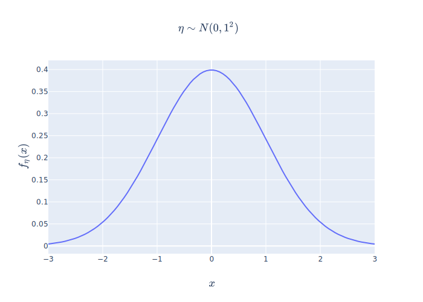
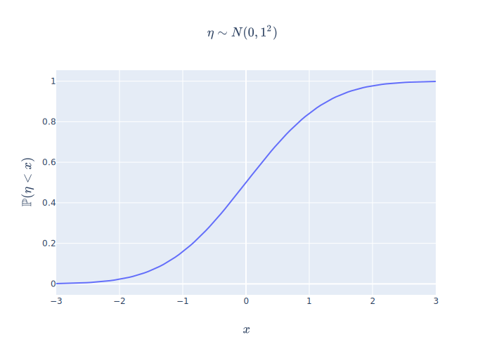

<!-- mathFunc{name, leftDelim, argument, rightDelim} -->
\providecommand{\mathFunc}[4]{#1\left#2\, #3 \,\right#4}
\providecommand{\mathbbFunc}[4]{\mathFunc{\mathbb{#1}}{#2}{#3}{#4}}
\providecommand{\mathrmFunc}[4]{\mathFunc{\mathrm{#1}}{#2}{#3}{#4}}
\providecommand{\Prob}[1]{\mathbbFunc{P}{(}{#1}{)}}
\providecommand{\Expect}[1]{\mathbbFunc{E}{[}{#1}{]}}
\providecommand{\Var}[1]{\mathrmFunc{Var}{[}{#1}{]}}

# Задание №1

## Выбор распределений

Выбранные распределения:

* Дискретное: [*гипергеометрическое*](https://ru.wikipedia.org/wiki/Гипергеометрическое_распределение)
* Непрерывное: [*нормальное*](https://ru.wikipedia.org/wiki/Нормальное_распределение)

## Описание основных характеристик распределений

### Гипергеометрическое распределение

Гипергеометрическое распределение - дискретное распределение, описывающее вероятность события, при котором ровно $k$
из $n$ случайно выбранных элементов окажутся *помеченными*, при этом выборка осуществляется из множества мощности $N$,
в котором присутствует $m$ помеченных элементов. Считается, что каждый из элементов может быть выбран с одинаковой
вероятностью $\frac{1}{N}$. Запишем это формально:
$$\begin{gathered}
    N \in \mathbb{N},\ m \in \overline{0, N},\ n \in \overline{0, N},\\
    k \in \overline{0, n}
\end{gathered}$$
Тогда $HG(N, m, n)$ описывает вероятность события,
при котором ровно $k$ из $n$ элементов выборки окажутся *помеченными*:
$$\left\{\ \xi \sim HG(N, m, n)\ \right\}
\iff
\left\{\Prob{\xi=k} = \frac{\binom{m}{k}\binom{N-m}{n-k}}{\binom{N}{n}}\right\}$$
{#eq:hg_def}

#### Математическое ожидание

По определению, математическое ожидание случайной величины – это ее $1^\text{й}$ начальный момент.
Для начала, найдем $k^\text{й}$ начальный момент для $\xi$ (это понадобится для дальнейших выводов):
$$\Expect{\xi^r}
= \sum_{k=0}^{n} k^r \cdot \Prob{\xi=k}
= \sum_{k=0}^{n} k^r\frac{\binom{m}{k}\binom{N-m}{n-k}}{\binom{N}{n}}$$
{#eq:hg_moment_raw_k_def}
Можем считать, что сумма берется при $k=\overline{1,n}$, так как слагаемое при
$k=0$ будет равно $0$. Заметим, что
$$\begin{aligned}
    k\binom{m}{k} &= k \frac{m!}{k!(m-k)!} =\\
                &= k \frac{m \cdot (m-1)!}{k \cdot (k-1)! \cdot (m-k)!} =\\
                &= m \frac{(m-1)!}{(k-1)! \cdot \left(m-1 - (k-1)\right)!} =\\
                &= m \binom{m-1}{k-1}
\end{aligned}$$
{#eq:binom-1}
и, как следствие,
$$\binom{N}{n}
= \frac{1}{n} \cdot n \cdot \binom{N}{n}
= \frac{1}{n} N \binom{N-1}{n-1}$$
{#eq:binom-1-cons}
Подставим [-@eq:binom-1] и [-@eq:binom-1-cons] в [-@eq:hg_moment_raw_k_def]:
$$\Expect{\xi^r} = \frac{n \cdot m}{N}
\sum_{k=1}^{r-1} \frac{\binom{m-1}{k-1}\binom{N-m}{n-k}}{\binom{N-1}{n-1}}$$
Положим $j := k-1$ и изменим индекс суммирования на $j = \overline{0, n-1}$.
Заметим, что $n - k = n - (j+1) = (n-1) - j$ и $N - m = (N-1) - (m-1)$:
$$\Expect{\xi^r} = \frac{n \cdot m}{N} \textcolor{lightblue}{\sum_{j=0}^{n-1} (j+1)^{r-1}
\frac{\binom{m-1}{j}\binom{(N-1) - (m-1)}{(n-1) - j}}{\binom{N-1}{n-1}}}$$
Заметим, что выделенная часть выражения может быть записана, как
$\Expect{(\theta+1)^{r-1}}$, где $\theta \sim HG(N-1, m-1, n-1)$.
Следовательно,
$$\Expect{\xi^r} = \frac{n \cdot m}{N} \Expect{(\theta+1)^{r-1}}$$
{#eq:hg_moment_raw_k}
Таким образом,
$$\boxed{
    \Expect{\xi} = \frac{n \cdot m}{N}
}$$
{#eq:hg_expected}

#### Дисперсия

По определению дисперсии,
$$\Var{\xi} = \Expect{\left(\ \xi - \Expect{\xi}\ \right)^2} = \Expect{\xi^2} - \left(\ \Expect{\xi}\ \right)^2$$
{#eq:variance_def}
Выведем $2^\text{й}$ начальный момент из [-@eq:hg_moment_raw_k]:
$$\Expect{\xi^2}
= \frac{n \cdot m}{N}\Expect{\theta+1}
= \frac{n \cdot m}{N}\left(\frac{(n-1)(m-1)}{N-1}+1\right)$$
{#eq:hg_raw_moment_2}
Подставим [-@eq:hg_expected] и [-@eq:hg_raw_moment_2] в [-@eq:variance_def]:
$$\begin{aligned}
    \Var{\xi} &= \Expect{\xi^2} - \left(\Expect{\xi}\right)^2 =\\
              &= \frac{n \cdot m}{N}\left(\frac{(n-1)(m-1)}{N-1}+1\right)
                    - \left(\frac{n \cdot m}{N}\right)^2=\\
              &= \frac{n \cdot m}{N}\left(\frac{(n-1)(m-1)}{N-1} + 1
                   - \frac{n \cdot m}{N}\right)
\end{aligned}$$
Таким образом,
$$\boxed{
    \Var{\xi} = \frac{n \cdot m}{N}\left(\frac{(n-1)(m-1)}{N-1} + 1 - \frac{n \cdot m}{N}\right)
}$$

#### Производящая функция моментов

По определению, производящая функция моментов $M_\xi(t)$ для случайной величины $\xi$ – это математическое ожидание новой случайной величины $e^{t\xi}$. То есть:
$$M_\xi(t) = \Expect{e^{t\xi}}$$
{#eq:mgf_def}
Для $\xi \sim HG(N, m, n)$ производящая функция [выглядит](https://ru.wikipedia.org/wiki/Гипергеометрическое_распределение) так:
$$M_\xi(t) = \frac{\binom{N-D}{n}}{\binom{N}{n}}\ {}_{2}F_{1}\left(-n, -D; N-D-n+1; e^t\right)$$
{#eq:hg_mgf}
Здесь ${}_{2}F_{1}$ - это [гипергеометрическая функция](https://en.wikipedia.org/wiki/Hypergeometric_function), определенная следующим образом:
$${}_{2}F_{1}(a,b;c;z) = \sum_{n=0}^{\infty} \frac{a^{(n)} b^{(n)}}{c^{(n)}} \frac{z^n}{n!}$$
, а $x^{(n)}$ - [возрастающий факториал](https://en.wikipedia.org/wiki/Falling_and_rising_factorials), определенный как:
$$x^{(n)} = \prod_{k=0}^{n-1} (x + k)$$

#### Характеристическая функция

По определению, характеристическая функция случайно величины $\xi$ задается следующим образом:
$$\varphi_\xi (t) = \Expect{e^{it\xi}}$$
Для $\xi \sim HG(N, m, n)$ характеристическая функция [выглядит](https://ru.wikipedia.org/wiki/Гипергеометрическое_распределение) так:
$$M_\xi(t) = \frac{\binom{N-D}{n}}{\binom{N}{n}}\ {}_{2}F_{1}\left(-n, -D; N-D-n+1; e^{it}\right)$$

#### Гистограмма вероятностей

Гистограмма – это графическое представление функции, приближающей плотность вероятности распределения на основе выборки из него.

Чтобы построить гистограмму, сначала нужно разбить множество значений выборки на несколько отрезков. Чаще всего, берут отрезки одинаковой длины, чтобы облегчить восприятие получившегося результата, однако это необязательно. Далее подсчитывается количество вхождений элементов выборки в каждый из отрезков и рисуются прямоугольники, по площади пропорциональные количеству попавших элементов выборки в соответствующий отрезок.

Вообще говоря, гистограмму можно использовать не только для приближения плотности на основе выборки, но и для визуализации самой плотности распределения, зная его плотность.

Мы будем строить гистограмму вероятностей, писать будем на языке [Python3](https://www.python.org) и использовать следующие библиотеки:

* [NumPy](https://numpy.org) для работы с массивами
* [SciPy](https://www.scipy.org) для комбинаторных и статистических функций
* [Plotly](https://plot.ly/python/) для визуализации

Итак, для начала, определим класс гипергеометрического распределения `HG`, который будет содержать в себе информацию о параметрах $N$, $m$ и $n$ и предоставлять метод `p(k)`, возвращающий вероятность принятия случайной величиной значения `k` при данных параметрах:
```{.python .numberLines startFrom="1"}
import scipy as sp

class HG(object):
    def __init__(self, N: int, m: int, n: int):
        self.N = N
        self.m = m
        self.n = n
    
    def p(self, k: int) -> float:
        return sp.special.comb(self.m, k) * sp.special.comb(self.N-self.m, self.n-k) / sp.special.comb(self.N, self.n)
    
    def __str__(self) -> str:
        return f'HG({self.N}, {self.m}, {self.n})'
```
Далее создадим объект случайной величины $\xi \sim HG(30, 15, 20)$:
```{.python .numberLines startFrom="14"}
xi = HG(30, 15, 20)
```
Следующим шагом, определим интервал $\overline{0, n}$, на котором мы будем рисовать нашу гистограмму:
```{.python .numberLines startFrom="15"}
import numpy as np

hist_data_x = np.arange(xi.n+1)
```
И, наконец, построим гистограмму и выведем ее:
```{.python .numberLines startFrom="18"}
import plotly
import plotly.graph_objs as go
hg_hist_fig = go.Figure(
    data=(go.Scatter(
        x=list(hist_data_x),
        y=list(map(xi.p, hist_data_x)),
        mode='markers',
    ),),
    layout=go.Layout(
        title=go.layout.Title(
            text=r'$\xi \sim ' + str(xi) + '$',
            x=.5,
        ),
        yaxis=go.layout.YAxis(title=go.layout.yaxis.Title(
            text=r'$\mathbb{P}(\xi=k)$',
        )),
        xaxis=go.layout.XAxis(title=go.layout.xaxis.Title(
            text=r'$k$',
        )),
        paper_bgcolor='rgba(0,0,0,0)',
    ),
)
plotly.offline.iplot(hg_hist_fig)
```
Получившаяся гистограмма имеет следующий вид:


#### Функция распределения

По определению, функция распределения $F_\xi(k) = \Prob{\xi < k}$. Для дискретной случайной величины событие $\{\xi < k\} = \bigcup\limits_{i=0}^{k-1}\{\xi=i\}$.
Каждое из событий $\{\xi=i\}\; \forall i \in \overline{0, k-1}$ являются попарно
несовместными. То есть $\forall i,j \in \overline{0, k-1}: i \neq j$
выполняется $\{\xi=i\}\cap\{\xi=j\}=\emptyset$. Из этого следует, что
$$\Prob{\xi < k} = \sum_{i=0}^{k-1}\Prob{\xi = i}$$
Подставим [-@eq:hg_def] в это выражение и получим:
$$F_\xi(k)
= \sum_{i=0}^{k-1}\Prob{\xi = i}
= \sum_{i=0}^{k-1}\frac{\binom{m}{i}\binom{N-m}{n-i}}{\binom{N}{n}}$$

Построим график этой функции, учитывая, что аргументом $k$ должно быть натуральное число,
не превосходящее $n$:
```{.python .numberLines startFrom="41"}
n_dist_fig = go.Figure(
    data=(go.Scatter(
        x=list(n_data_x),
        y=list(map(eta.p, n_data_x)),
    ),),
    layout=go.Layout(
        title=go.layout.Title(
            text=r'$\eta \sim ' + str(eta) + '$',
            x=.5,
        ),
        yaxis=go.layout.YAxis(
            title=go.layout.yaxis.Title(
                text=r'$\mathbb{P}(\eta<x)$',
            ),
        ),
        xaxis=go.layout.XAxis(
            title=go.layout.xaxis.Title(
                text=r'$x$',
            ),
        ),
        # paper_bgcolor='rgba(0,0,0,0)',
    ),
)
plotly.offline.iplot(n_dist_fig)
```
График будет следующим:


### Нормальное распределение

Нормальное распределение - непрерывное распределение, описывающее поведение
величины отклонения измеряемого значения $x$ от истинного значения $\mu$
(которое является математическим ожиданием) и в рамках некоторого разброса
$\sigma$ (среднеквадратичного отклонения). Запишем это формально:
$$\left\{ \eta \sim N(\mu, \sigma^2) \right\}
\iff
\left\{\begin{gathered}
    F_\eta(x) = \Prob{\eta < x} = \int_{-\infty}^{x} f_\eta(x)dx,\\
    \text{где } f_\eta(x) = \frac{1}{\sigma\sqrt{2\pi}}e^{-\frac{(x-\mu)^2}{2\sigma^2}} \text{– плотность вероятности}
\end{gathered}\right\}$$
{#eq:norm_def}

#### Математическое ожидание

Найдем математическое ожидание $\eta \sim N(\mu, \sigma^2)$:
$$\begin{aligned}
    \Expect{\eta} &= \int_{-\infty}^{+\infty} x \cdot f_\eta(x)dx =\\
                  &= \int_{-\infty}^{+\infty} xe^{-\frac{(x-\mu)^2}{2\sigma^2}}dx =\\
                  &= \frac{1}{\sigma\sqrt{2\pi}} \int_{-\infty}^{+\infty} xe^{-\frac{(x-\mu)^2}{2\sigma^2}}dx
\end{aligned}$$
Сделаем замену $t = \frac{x-\mu}{\sqrt{2}\sigma}$:
$$\begin{aligned}
    \Expect{\eta} &= \frac{1}{\sigma\sqrt{2\pi}} \int_{-\infty}^{+\infty}(\sigma\sqrt{2}t + \mu)
                    e^{-t^2} d\left(\frac{x-\mu}{\sqrt{2}\sigma}\right) =\\
                  &= \frac{\sigma\sqrt{2}}{\sqrt{\pi}}\int_{-\infty}^{+\infty}te^{-t^2}dt
                    + \frac{\mu}{\sqrt{\pi}}\int_{-\infty}^{+\infty}e^{-t^2}dt =\\
                  &= \frac{\sigma\sqrt{2}}{\sqrt{\pi}}\left(\int_{-\infty}^{0}te^{-t^2}dt
                    - \int_{-\infty}^{0}te^{-t^2}dt\right) + \frac{\mu}{\sqrt{\pi}}\int_{-\infty}^{+\infty}e^{-t^2}dt =\\
                  &= \frac{\mu}{\sqrt{\pi}}\int_{-\infty}^{+\infty}e^{-t^2}dt
\end{aligned}$$
Заметим, что получившееся выражение содержит интеграл,
который может быть сведен к интегралу [Эйлера-Пуассона](https://ru.wikipedia.org/wiki/Гауссов_интеграл):
$$\int_{-\infty}^{+\infty}e^{-t^2}dt = 2\int_{0}^{+\infty}e^{-t^2}dt = \sqrt{\pi}$$
Таким образом,
$$\boxed{
    \Expect{\eta} = \mu
}$$
{#eq:n_expected}

#### Дисперсия

Подставим [-@eq:n_expected] в определение дисперсии [-@eq:variance_def]:
$$\begin{aligned}
    \Var{\eta} &= \Expect{(\eta - \mu)^2} =\\
               &= \int_{-\infty}^{+\infty} (x-\mu)^2 \cdot f_{\eta}(x)dx =\\
               &= \int_{-\infty}^{+\infty}(x-\mu)^2 \frac{1}{\sigma\sqrt{2\pi}}e^{-\frac{(x-\mu)^2}{2\sigma^2}}dx =\\
               &= \frac{1}{\sigma\sqrt{2\pi}}\int_{-\infty}^{+\infty}(x-\mu)^2 e^{-\frac{(x-\mu)^2}{2\sigma^2}}dx
\end{aligned}$$
Сделаем ту же замену переменной $t = \frac{x-\mu}{\sqrt{2}\sigma}$, тогда $x = t\sqrt{2}\sigma+\mu$ и:
$$\begin{aligned}
    \Var{\eta} &= \frac{1}{\sigma\sqrt{2\pi}}
                \int_{-\infty}^{+\infty}(\sqrt{2}\sigma)^2 t^2 e^{-t^2}d(t\sqrt{2}\sigma+\mu) =\\
               &= \frac{2\sigma^2}{\sqrt{\pi}}\int_{-\infty}^{+\infty}t^2 e^{-t^2}dt
\end{aligned}$$
Проинтегрируем по частям:
$$\begin{aligned}
    \Var{\eta} &= \frac{\sigma^2}{\sqrt{\pi}}\int_{-\infty}^{+\infty}t 2t e^{-t^2} dt =\\
               &= \frac{\sigma^2}{\sqrt{\pi}}\left(\left. -t e^{-t^2} \right|_{-\infty}^{+\infty}
                 + \int_{-\infty}^{+\infty}e^{-t^2}dt\right)
\end{aligned}$$
Здесь снова появляется интеграл [Эйлера-Пуассона](https://ru.wikipedia.org/wiki/Гауссов_интеграл) и, в итоге, получаем:
$$\boxed{
    \Var{\eta} = \sigma^2
}$$
То есть, $\sigma$ является среднеквадратичным отклонением.

#### Производящая функция моментов

Производящая функция моментов для $\eta \sim N(\mu, \sigma^2)$ имеет вид:
$$M_\eta(t) = \exp\left(\mu t + \frac{\sigma^2 t^2}{2}\right)$$

#### Характеристическая функция

Характеристическая функция для $\eta \sim N(\mu, \sigma^2)$ имеет вид:
$$\varphi_\eta(t) = \exp\left(\mu it + \frac{\sigma^2 t^2}{2}\right)$$

#### Плотность вероятности

Определим класс нормального распределения `N`, который будет содержать в себе информацию о параметрах $\mu$ и $\sigma$ и предоставлять следующие методы:

* `f(x)` - возвращает значение плотности в точке `x`
* `p(k)` - возвращает $\Prob{\eta < x} = \int_{-\infty}^x f_\eta(x)dx$

```{.python .numberLines startFrom="1"}
class N(object):
    def __init__(self, mu: float, sigma: float):
        self.mu = mu
        self.sigma = sigma
    def f(self, x: float) -> float:
        return np.exp(-((x-self.mu)**2)/(2*self.sigma**2))/(self.sigma*(2*np.pi)**.5)
    def p(self, x: float) -> float:
        return sp.integrate.quad(self.f, -np.inf, x)[0]
    def __str__(self):
        return f'N({self.mu}, {self.sigma}^2)'
```
Далее создадим объект случайной величины $\xi \sim HG(30, 15, 20)$:
```{.python .numberLines startFrom="11"}
eta = N(0, 1)
```
Следующим шагом, руководствуясь [правилом трех сигм](https://ru.wikipedia.org/wiki/Среднеквадратическое_отклонение#Правило_трёх_сигм)определим интервал $(-3\sigma, 3\sigma)$:
```{.python .numberLines startFrom="12"}
n_data_x = np.linspace(-3*eta.sigma, 3*eta.sigma, 100)
```
И, наконец, построим плотность, используя метод `N.f` нашего класса:
```{.python .numberLines startFrom="13"}
n_dens_fig = go.Figure(
    data=(go.Scatter(
        x=list(n_data_x),
        y=list(map(eta.f, n_data_x)),
    ),),
    layout=go.Layout(
        title=go.layout.Title(
            text=r'$\eta \sim ' + str(eta) + '$',
            x=.5,
        ),
        yaxis=go.layout.YAxis(
            title=go.layout.yaxis.Title(
                text=r'$f_\eta(x)$',
            ),
        ),
        xaxis=go.layout.XAxis(
            title=go.layout.xaxis.Title(
                text=r'$x$',
            ),
        ),
        # paper_bgcolor='rgba(0,0,0,0)',
    ),
)
plotly.offline.iplot(n_dens_fig)
```
Получившийся график имеет следующий вид:



#### Функция распределения

Для построения функции распределения, будем использовать метод `N.p`:
```{.python .numberLines startFrom="37"}
n_dist_fig = go.Figure(
    data=(
        go.Scatter(
            x=list(n_data_x),
            y=list(map(eta.p, n_data_x)),
        ),
    ),
    layout=go.Layout(
        title=go.layout.Title(
            text=r'$\eta \sim ' + str(eta) + '$',
            x=.5,
        ),
        yaxis=go.layout.YAxis(
            title=go.layout.yaxis.Title(
                text=r'$\mathbb{P}(\eta<x)$',
            ),
        ),
        xaxis=go.layout.XAxis(
            title=go.layout.xaxis.Title(
                text=r'$x$',
            ),
        ),
        # paper_bgcolor='rgba(0,0,0,0)',
    ),
)
plotly.offline.iplot(n_dist_fig)
```
Функция распределения имеет вид:



## Примеры событий и интерпретации

### Гипергеометрическое распределение

#### Типичная интерпретация

Типичной интерпретацией гипергеометрического распределения является выборка без возвращения из множества элементов, некоторые из которых являются помеченными. Представим, что в нашем распоряжении имеется корзина, наполненная шарами двух цветов: черные и белые. Причём всего в корзине находится $N$ шаров, $m$ из которых – белые. Шары в корзине тщательно перемешиваются, чтобы каждый из них мог быть вытащен с одинаковой вероятностью $\frac{1}{N}$. Далее случайно вытаскиваются $n$ шаров без возвращения. Гипергеометрическое распределение описывает вероятность того, что среди вытащенных шаров ровно $k$ окажутся белыми. 

Действительно, всего существует $\binom{N}{n}$ выборок размера $n$, $\binom{m}{k}$ способов выбрать $k$ помеченных объектов (белых шаров), и $\binom{N-m}{n-k}$ способов заполнить оставшиеся $n-k$ *слотов* непомеченными объектами (черными шарами). Таким образом, вероятность того, что среди $n$ вытащенных объектов окажется ровно $k$ помеченных, будет равна $\frac{\binom{m}{k}\binom{N-m}{n-k}}{\binom{N}{n}}$.

#### Известные соотношения между распределениями

* Если зафиксировать размер выборки и количество помеченных элементов, а мощность множества, из которого ведется выборка, устремить к бесконечности, то гипергеометрическое распределение будет сходиться к биномиальному:
$$HG(N, m, n) \underset{N\to\infty}{\longrightarrow} Bi\left(n, \frac{m}{N}\right)$$

### Нормальное распределение

#### Типичная интерпретация

Нормальное распределение описывает нормированную случайную величину, которая является суммой многих случайных слабо взаимосвязанных величин, каждая из которых вносит малый вклад относительно общей суммы. Это вытекает из [центральной предельной теоремы](https://ru.wikipedia.org/wiki/Центральная_предельная_теорема).

#### Известные соотношения между распределениями

* Сумма двух независимых случайных величин, имеющих нормальное распределение, имеет [распределение Коши](https://ru.wikipedia.org/wiki/Распределение_Коши):
$$\begin{aligned}
\xi\ &\sim\ N(\mu_1, {\sigma_1}^2)\\
\eta\ &\sim\ N(\mu_2, {\sigma_2}^2)\\
\xi+\eta\ &\sim\ C(\mu_1 + \mu_2, \sqrt{{\sigma_1}^2 + {\sigma_2}^2})
\end{aligned}$$
<!-- http://scask.ru/a_book_tp.php?id=61 -->

* Сумма квадратов $k$ независимых стандартных нормальных случайных величин имеет [распределение $\chi^2$](https://ru.wikipedia.org/wiki/Распределение_хи-квадрат) c $k$ степенями свободы:
$$\begin{aligned}
\forall i \in \overline{1, k}\quad \xi_i\ &\sim\ N(0, 1)\\
\sum_{i=1}^k \xi_i &\sim \chi^2(k)
\end{aligned}$$

* Натуральный логарифм [логнормального распределения](https://ru.wikipedia.org/wiki/Логнормальное_распределение) имеет нормальное распределение:
$$\begin{aligned}
\xi &\sim LogN(\mu,\sigma^2)\\
\ln\xi &\sim N(\mu,\sigma^2)
\end{aligned}$$
